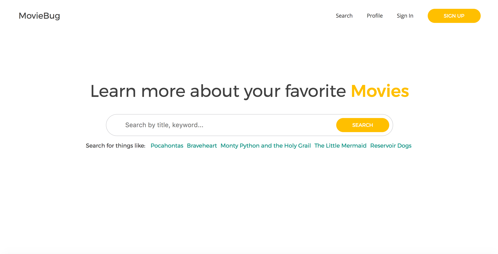
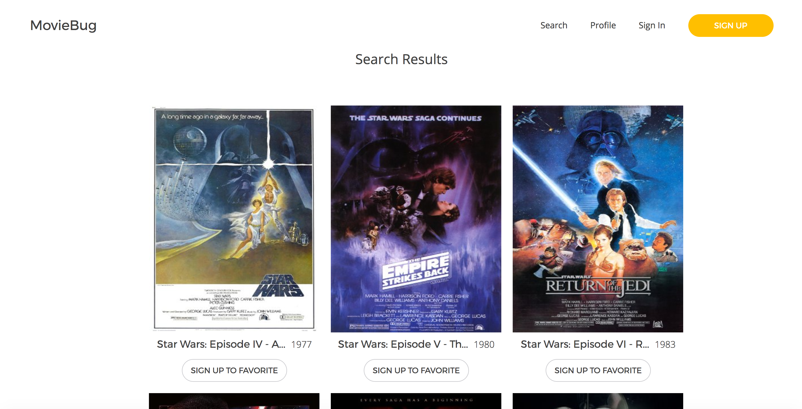
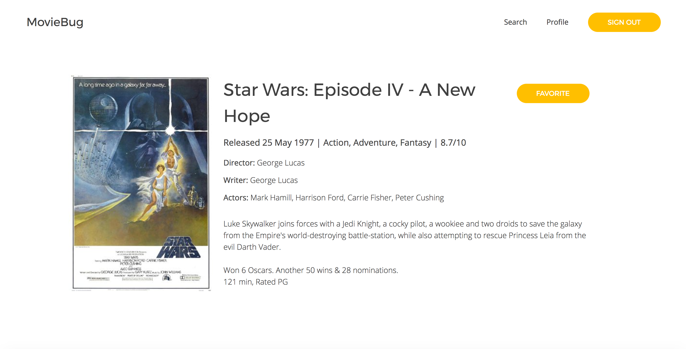
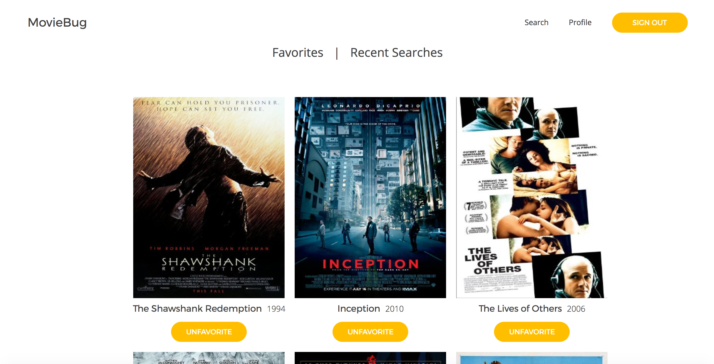
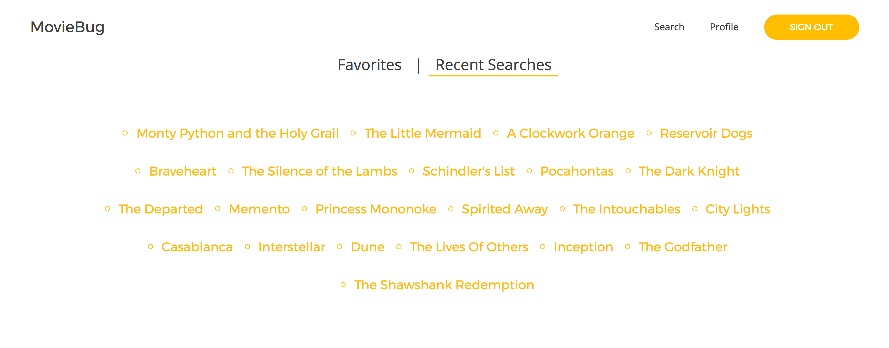

# MovieBug

Find what to watch next with [MovieBug!][moviebug] Integrating the OMDB api, MovieBug is a web application for searching for information about movies. MovieBug incorporates the richness of IMDB data with a simple, clean interface. Registered users can favorite movies also view their favorites and recent searches in their profile.

## Search

On the homepage / search page there is a prominent search bar, below it is a selection of all users recent searches as examples for things to search. You can click on one to search for that movie yourself, or type a movie topic into the search bar and press enter (or the search button). You will be taken to a results page if any movies are found for your query.

If you want to save any favorites, be sure to sign in! Click on any of the results for a more detailed view.

## Profile

Registered users can view their profile, which contains favorited movies and recent search results.

By default, the favorited movies are shown first, click recent searches on the top toggle to switch to recent searches.

## Technology

MovieBug is a single-page application built on Rails with a Postgres database and React.js / Redux on the frontend, using webpack for bundling.

To run on your own computer, you will need homebrew and to brew install Ruby, Rails, PostgreSQL, and Node if you are missing any, as well as the Ruby bundler gem. Bundle install the required gems, npm install the node modules, start webpack, and run the rails server. (I would suggest just looking at [moviebug.katarinarossi.com][moviebug] instead).

[moviebug]: http://moviebug.katarinarossi.com
